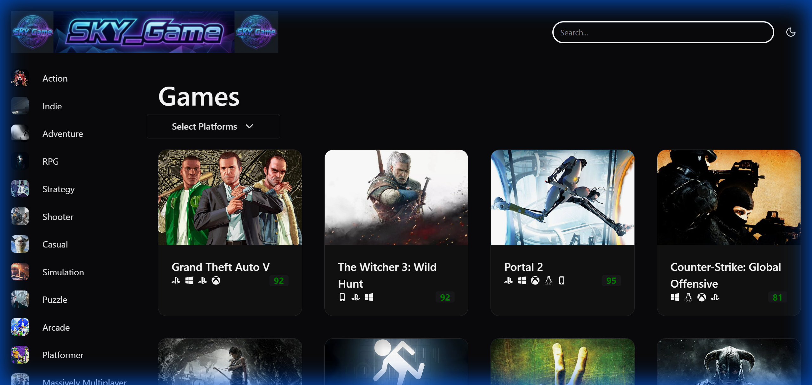

# 🎮 SKY Game - Game Discovery Platform

A modern, responsive game discovery platform built with React and Chakra UI. Browse thousands of games, filter by genre and platform, and discover your next favorite game!




## ✨ Features

- 🎯 **Browse Games**: Explore a vast collection of games from the RAWG database
- 🔍 **Smart Search**: Quickly find games by name
- 🎨 **Filter by Genre**: Browse games by categories (Action, RPG, Strategy, etc.)
- 🎮 **Platform Filter**: Filter games by gaming platform (PlayStation, Xbox, PC, etc.)
- 🌓 **Dark/Light Mode**: Toggle between dark and light themes
- 📱 **Responsive Design**: Optimized for desktop, tablet, and mobile devices
- ⚡ **Fast Performance**: Built with Vite for lightning-fast loading

## 🛠️ Tech Stack

### Core
- **React 19.2.0** - Modern UI library
- **TypeScript** - Type-safe JavaScript
- **Vite** - Next-generation frontend tooling

### UI Framework
- **Chakra UI v3** - Component library
  - [@chakra-ui/react](https://chakra-ui.com/)
  - next-themes - Theme management
  - @emotion/react - CSS-in-JS

### Data & API
- **Axios** - HTTP client for API requests
- **RAWG API** - Game database API ([rawg.io/apidocs](https://rawg.io/apidocs))

### Additional Libraries
- **React Icons** - Icon library
- **React Router** (if applicable) - Client-side routing

### Validation & Forms (Referenced)
- React Hook Form - Form state management
- Zod - Schema validation
- @hookform/resolvers - Form validation integration

## 📋 Prerequisites

Before you begin, ensure you have the following installed:
- **Node.js** (v16 or higher)
- **npm** or **yarn** package manager

## 🚀 Installation

1. **Clone the repository**
   ```bash
   git clone https://github.com/YasithaMiyuranga/React-Chakra-UI.git
   cd React-Chakra-UI
   ```

2. **Install dependencies**
   ```bash
   npm install
   ```

3. **Get your API Key**
   - Visit [RAWG API](https://rawg.io/apidocs)
   - Sign up for a free account
   - Get your API key

4. **Configure API Key**
   - Create a `.env` file in the root directory
   - Add your RAWG API key:
     ```env
     VITE_RAWG_API_KEY=your_api_key_here
     ```
   - Or update the API key in your API service file

## 💻 Development

Run the development server:

```bash
npm run dev
```

The application will open at `http://localhost:5173`

## 🏗️ Build for Production

Create a production build:

```bash
npm run build
```

Preview the production build:

```bash
npm run preview
```

## 📁 Project Structure

```
React-Chakra-UI/
├── src/
│   ├── components/         # React components
│   │   ├── ui/            # Chakra UI components
│   │   ├── GameGrid.tsx   # Game cards grid
│   │   ├── GenreList.tsx  # Genre sidebar
│   │   ├── NavBar.tsx     # Navigation bar
│   │   ├── SearchInput.tsx # Search functionality
│   │   └── ...
│   ├── hooks/             # Custom React hooks
│   │   ├── useGames.ts    # Fetch games data
│   │   ├── useGenre.ts    # Fetch genres
│   │   └── ...
│   ├── assets/            # Images and static files
│   ├── App.tsx            # Main app component
│   └── main.tsx           # App entry point
├── screenshots/           # Project screenshots
├── package.json
└── README.md
```

## 🎯 Usage

1. **Browse Games**: Scroll through the game grid on the homepage
2. **Search**: Use the search bar in the navigation to find specific games
3. **Filter by Genre**: Click on genres in the left sidebar to filter games
4. **Filter by Platform**: Use the platform selector dropdown
5. **Toggle Theme**: Click the sun/moon icon in the top right to switch themes

## 🔑 API Configuration

This project uses the [RAWG Video Games Database API](https://rawg.io/apidocs).

**Important**: Replace the API key in your API service with your own key:
- Current placeholder: `[RAWG API KEY]`
- Get your free API key at: [rawg.io](https://rawg.io/)

## 📦 Key Dependencies

| Package | Version | Purpose |
|---------|---------|---------|
| react | ^19.2.0 | UI framework |
| @chakra-ui/react | ^3.31.0 | UI components |
| axios | ^1.13.2 | API requests |
| react-icons | ^5.5.0 | Icon library |
| vite | ^7.2.4 | Build tool |

## 🌐 Resources & References

- [Chakra UI Documentation](https://chakra-ui.com/docs/get-started/frameworks/vite)
- [RAWG API Documentation](https://rawg.io/apidocs)
- [React Hook Form](https://react-hook-form.com/)
- [Zod Validation](https://zod.dev/)
- [React Icons](https://react-icons.github.io/react-icons/)
- [JSONPlaceholder](https://jsonplaceholder.typicode.com/) - API testing

## 🤝 Contributing

Contributions are welcome! Feel free to submit issues and pull requests.

## 📄 License

This project is open source and available under the [MIT License](LICENSE).

## 🙏 Acknowledgments

- Game data provided by [RAWG](https://rawg.io/)
- UI components by [Chakra UI](https://chakra-ui.com/)
- Icons by [React Icons](https://react-icons.github.io/react-icons/)

---
